# Advanced Beginner's Guide to the H.264 RTQC System: Diving Deeper into the Tech

Hey there! If the previous guide got you hooked on video compression but left you hungry for *more*—like, "How does the AI actually 'see' the video?" or "What's under the hood of that training loop?"—you're in the right place. We'll build on the basics, assuming you've got the high-level scoop (videos → compression → AI magic → optimized files). Now, we'll geek out with technical depth: model guts, training wizardry, hyperparameter tweaks, and real math behind the metrics. Still beginner-friendly with analogies, examples, and visuals, but with code snippets and equations for the curious.

Think of this as *Beginner's Guide 2.0*: From "Why?" to "How?" We'll expand each section, add new ones on the model's "brain," and end with an even fancier diagram. By the end, you'll feel like you could tweak the code yourself.

Ready? Let's level up!

## Recap: The Big Picture (Quick Refresh)
Videos are huge flipbooks. H.264 compresses them using QP (the "squish knob"): Low QP = pretty but big; high QP = small but meh. PSNR measures "how pretty" (higher dB = better). Problem: Videos vary (beach chill vs. soccer chaos), so one QP fits none.

**Repo's Superpower**: AI predicts *exact* QP for your PSNR goal, slashing guesswork. Trained on samples, it uses a 3D CNN (video-savvy neural net) + PSNR "mood adjuster" to nail it. Results? 96.6% less QP error (from ~22 to ~0.75) and 66.1% tighter PSNR (from ~11 dB off to ~3.6 dB off). Real-time? Yep—infers in seconds on a laptop.

**Example Reminder**: Cat video targeting PSNR 30? AI says QP=24. Old way: 10-min trials. New: Instant win.

Now, deeper!

## Step 1: Deeper Dive – Compression Math and Why AI Wins
### H.264's Inner Workings: Beyond the Knob
H.264 (aka AVC) isn't just "squish"—it's a block-based beast. Videos split into 16x16 "macroblocks." Compression tricks:
- **Intra/Inter Prediction**: Copy pixels from nearby blocks/frames (like "this wave looks like the last one").
- **Transform + Quantization**: DCT (discrete cosine transform—like Fourier for images) packs energy into few coeffs. *Quantization* divides by QP-scaled tables, rounding away "noise" (high QP = aggressive rounding = smaller files, more artifacts).
- **Entropy Coding**: Huffman-like zips the bits.

**Math Bite**: PSNR = 10 * log10( (MAX^2) / MSE ), where MSE is mean squared error between original/reconstructed pixels, MAX=255 (8-bit). Target PSNR 35 dB? MSE < ~3.2—tiny differences!

**Why Videos Differ**: "Spatial complexity" (textures) + "temporal complexity" (motion) vary. Soccer: High both → needs low QP to avoid blocky artifacts. Beach: Low → higher QP fine.

**AI Edge**: Humans guess; AI *learns* patterns from 1,000s of encodes. Baseline error: Pick average QP=26? Miss by 22 on wild videos. AI: Miss by 0.75.

**Table: Compression Trade-offs**
| Aspect          | Low QP (e.g., 10) | High QP (e.g., 40) | AI's Smart Pick |
|-----------------|-------------------|--------------------|-----------------|
| File Size      | Huge (~100MB/10s) | Tiny (~2MB/10s)   | Balanced (e.g., 5MB for PSNR 35) |
| Quality (PSNR) | Excellent (45+ dB)| Poor (<25 dB)     | On-target (±3.6 dB) |
| Use Case       | Archival          | Thumbs            | Streaming/Social |
| Example Video  | 4K Wedding        | Low-Bandwidth Chat| Instagram Reel  |

## Step 2: The Pipeline, Dissected – Code + Flow
Our flowchart was cute; now let's zoom *into* the boxes with PyTorch snippets (from the notebook). Pipeline: Video → Features → Condition → Predict → Encode.

Updated **Flowchart** (with tech labels—paste into Mermaid viewer):

```mermaid
flowchart TD
    A["Raw Video: [B,3,T,H,W]<br/>e.g., B=1, T=16 frames @30fps, H=W=224px"] --> B["Target PSNR: Scalar<br/>e.g., 35.0 dB"]
    B --> C["X3D Backbone: 3D CNN<br/>Conv3D Layers (3→128 ch)<br/>Output: 128D Features<br/>torch.nn.Conv3d(kernel=3)"]
    C --> D["Cond. GroupNorm: AdaIN-style<br/>γ,β = MLP(PSNR)<br/>Normalize + Scale/Shift<br/>For Quality Adaptation"]
    D --> E["FC Head: Dropout(0.5)<br/>128D → 64D → 52 Classes<br/>Softmax → QP Prob Dist.<br/>CrossEntropyLoss()"]
    E --> F["FFmpeg Encode: libx264<br/>ffmpeg -i in.mp4 -qp {pred} out.mp4<br/>PSNR via skimage"]
    F --> G["Eval: |pred_QP - opt_QP|, |PSNR - target|"]
    G --> H["Optimized H.264 MP4"]
    style A fill:#f9f
    style H fill:#bbf
```



### 1. Input Prep: From MP4 to Tensor
- **Code Snippet** (from notebook):
  ```python
  import torch
  from torchvision import transforms
  from pyav import VideoStreamReader  # Or OpenCV

  def load_video(video_path, clip_len=16, size=224):
      reader = VideoStreamReader(video_path)
      frames = []
      for frame in reader.decode(video=0):
          # Resize, normalize to [0,1], to tensor
          img = transforms.ToTensor()(frame.to_image())
          frames.append(img)
      # Sample/center-crop to clip_len frames
      video_tensor = torch.stack(frames[:clip_len])  # [T,3,H,W]
      return video_tensor.unsqueeze(0)  # [B=1,3,T,H,W]
  ```
- **Depth**: Clips to 16 frames (~0.5s @30fps) for efficiency. Resizes to 224x224 (X3D sweet spot). Why 16? Balances motion capture without GPU meltdown.
- **Example**: Cat vid → [1,3,16,224,224]. No audio—focus on visuals.

### 2. Feature Extraction: X3D – The Video Whisperer
- **What's X3D?** Extreme Inception 3D: Lightweight 3D CNN (vs. heavy like SlowFast). "3D" means kernels scan space *and* time (e.g., 3x3x3 filter catches ball trajectory).
- **Architecture Breakdown** (4 stages, ~5.8M params total):
  - Stage 1: Conv3D(3→16 ch, stride=1) + ReLU + Pool3D.
  - Stage 2: Conv3D(16→32, stride=2) – Downsamps time/space.
  - Stage 3: Conv3D(32→64, stride=2).
  - Stage 4: Conv3D(64→128) + Global Avg Pool → 128D vector (per clip).
- **Why It Rocks**: Captures "spatiotemporal" features—e.g., cat's fur blur (texture + motion variance).
- **Math**: Output feat = GAP( ReLU( Conv3D(x) ) ), where GAP averages over T/H/W.
- **Example**: Static interview → Low-variance feat (smooth 128D vec). Soccer → Spiky (high entropy).

### 3. PSNR Conditioning: The "Quality Dial" (Conditional GroupNorm)
- **Core Idea**: Don't predict blindly—*adapt* features to PSNR goal. Like telling the AI: "For high quality, amp up detail sensitivity."
- **How?** Conditional GroupNorm (inspired by AdaIN in style transfer):
  - Split feat channels into groups (e.g., 32 groups of 4).
  - Normalize: μ,σ per group → zero-mean unit-var.
  - Condition: Embed PSNR (via MLP: scalar → 128D γ/β vectors).
  - Adjust: feat' = γ * (feat - μ)/σ + β.
- **Code Snippet**:
  ```python
  class ConditionalGroupNorm(nn.Module):
      def __init__(self, num_channels, num_groups=32):
          super().__init__()
          self.gnorm = nn.GroupNorm(num_groups, num_channels)
          self.mlp = nn.Sequential(nn.Linear(1, num_channels), nn.ReLU())  # PSNR → γ/β

      def forward(self, x, psnr):  # x: [B,C,H',W'], psnr: [B,1]
          normed = self.gnorm(x)
          gamma, beta = self.mlp(psnr).chunk(2, dim=1)  # Split for scale/shift
          return gamma * normed + beta
  ```
- **Depth**: Enables "zero-shot" adaptation—no retrain per PSNR. For PSNR=40 (high qual), γ boosts high-freq channels (edges); PSNR=25 (low), dampens.
- **Example**: Cat vid @ PSNR 30 → Mild boost to motion channels. @40 → Extra sharp on whiskers.

### 4. QP Prediction: From Features to Number
- **Head**: Two FC layers (128→64→52) + Dropout(0.5) → Softmax.
- **Why 52 Classes?** QP=0-51 (H.264 standard).
- **Output**: Prob dist. → argmax for QP (or weighted avg for finer).
- **Loss**: CrossEntropy(pred_logit, optimal_QP_label).
- **Example**: Feats → logits → QP=24 (prob 0.92).

### 5. Encoding & Eval: Closing the Loop
- **FFmpeg Magic**:
  ```bash
  ffmpeg -i input.mp4 -c:v libx264 -qp {predicted_qp} -preset fast output.mp4
  ```
- **PSNR Calc**: `from skimage.metrics import peak_signal_noise_ratio` on frames.
- **Binary Search for Labels** (Training): To find "optimal" QP per PSNR:
  - Low=0, High=51.
  - Mid QP → Encode → PSNR → If > target, Low=Mid+1; else High=Mid-1.
  - ~6 encodes/clip (log2(52)).
- **Example**: Cat @35 PSNR → Search finds QP=22 (actual PSNR=35.2).

## Step 3: Training – How the AI Gets Street-Smart
New Section! Training turns raw code into a brain.

### Dataset: Tiny but Mighty
- Samples: `sample-5s.mp4` (calm), `sample-10s.mp4` (dynamic). Diverse content: gradients (smooth), checkerboards (patterns), noise (chaos), solids (easy).
- Prep: 100s clips via binary search → {video_tensor, psnr_target, optimal_qp_label}.
- **DataLoader**: Batch=8, shuffle=True.

### Loop Deets
- **Optimizer**: Adam (lr=1e-3).
- **Epochs**: 10 (converges fast on samples; scale to 100s for real datasets like Xiph.org).
- **Device**: GPU/CPU auto.
- **Code Snippet**:
  ```python
  from torch.optim import Adam
  from torch.utils.data import DataLoader

  model = H264QualityController().to(device)
  optimizer = Adam(model.parameters(), lr=1e-3)
  for epoch in range(10):
      for batch in dataloader:
          video, psnr, label = batch  # label: QP 0-51
          pred = model(video, psnr)
          loss = F.cross_entropy(pred, label)
          loss.backward(); optimizer.step()
  ```
- **Monitoring**: TensorBoard? Nah, notebook prints loss/acc/QP_error.
- **Fun Fact**: Pre-train (random model): QP error=21.75 (dumb guess). Post: 0.75. Why? Learns content-PSNR mappings.

### Hyperparams Table
| Param              | Value/Default | Why? |
|--------------------|---------------|------|
| Clip Len (T)      | 16 frames    | Motion w/o overload |
| Resolution        | 224x224      | X3D-optimized |
| Batch Size        | 8            | GPU-friendly |
| Learning Rate     | 1e-3         | Fast convergence |
| Dropout           | 0.5          | Anti-overfit |
| Groups in Norm    | 32           | Fine-grained adapt |
| Targets PSNR      | 20-45 dB     | Common range |

## Step 4: Eval & Visuals – Proof in the Pixels
### Metrics Deep Dive
- **QP Error**: MAE(pred, opt) = 0.75 post-train.
- **PSNR Gap**: MAE(actual, target) = 3.64 dB (e.g., aim 35 → get 38.64 or 31.36—still good!).
- **Why Not Perfect?** Encoding noise + model approx.

### Visuals Expanded
- **QP-PSNR Curve**: Nonlinear! Low QP: PSNR skyrockets; high: Flatlines. AI navigates the knee.
  *Equation*: PSNR(QP) ≈ a - b * QP^c (fitted curve in notebook).
- **Content Plots**: E.g., Noise vid: Steep drop (sensitive to QP). Solid: Shallow (forgiving).
- **Pipeline PNG**: Arrows show tensor flows—feat vec → conditioned → logits.

Run notebook's viz cell: Generates these + compares baseline vs. trained.

## Step 5: Extensions & Gotchas
- **Scale Up**: Add datasets (VMAF for perceptual qual). Swap X3D for R(2+1)D.
- **Real-Time?** Inference: <1s/clip on RTX 3060. Streaming: Predict per GOP (group of pictures).
- **Gotchas**: FFmpeg needs libx264 (install via brew/apt). No codec? Falls to JPEG (weird but works).
- **Example Tweak**: Target PSNR=25 for tiny files: AI ups QP to 35, gap still tight.

## Getting Started: Same, But Pro Tips
Same steps, but: 
- Train on your vids: `pipeline.train(num_epochs=20)`.
- Inference: `qp = model.predict(video, psnr=35); encode(qp)`.
- Debug: Notebook has print( feat.shape ) everywhere.

## Grand Finale: Enhanced Architectural Diagram
Behold—the full stack, with params and flows. (Mermaid: Layers as subgraphs.)

```mermaid
graph TB
    subgraph "Input"
        I1["Video Tensor<br/>[1,3,16,224,224]"]
        I2["PSNR Embed<br/>MLP(1 → 128) for γ/β"]
    end
    
    subgraph "X3D Backbone (~4M params)"
        S1["Conv3D: 3→16 ch<br/>3x3x3, stride=1"]
        S2["Conv3D: 16→32<br/>stride=2 (downsample)"]
        S3["Conv3D: 32→64<br/>stride=2"]
        S4["Conv3D: 64→128 + GAP<br/>→ [B,128]"]
    end
    
    subgraph "Conditioning (~50K params)"
        CGN["CondGroupNorm(128 ch, 32 groups)<br/>feat' = γ(PSNR) * norm(feat) + β(PSNR)"]
    end
    
    subgraph "Prediction Head (~1.7M params)"
        FC1["Linear(128→64) + ReLU + Dropout(0.5)"]
        FC2["Linear(64→52) + Softmax<br/>→ QP Dist (0-51)"]
    end
    
    subgraph "Output Pipeline"
        PRED["Argmax(QP) or Weighted Avg"]
        ENC["FFmpeg: -qp {QP} → H.264 MP4"]
        EVAL["PSNR Metric + Error Calc"]
    end
    
    I1 --> S1 --> S2 --> S3 --> S4 --> CGN
    I2 --> CGN
    CGN --> FC1 --> FC2 --> PRED --> ENC --> EVAL
    
    classDef input fill:#e1f5fe
    classDef backbone fill:#fff3e0
    classDef cond fill:#f3e5f5
    classDef head fill:#e8f5e8
    classDef out fill:#ffebee
    class I1,I2 input
    class S1,S2,S3,S4 backbone
    class CGN cond
    class FC1,FC2 head
    class PRED,ENC,EVAL out
```



- **Total Params**: ~5.8M (lightweight—fits phone AI).
- **Sparsity**: Dropout sparsifies during train; optional pruning post-train.
- **Sanity**: End-to-end differentiable? Almost—encoding's black-box, but labels from search ensure alignment.

Whew! From flipbooks to Conv3Ds—you're now repo-ready. Tweak, train, compress. Got a wild video? Test it and lmk results. Deeper still? Peek the notebook code.

*Compress on, code ninja!* 🚀🎥
